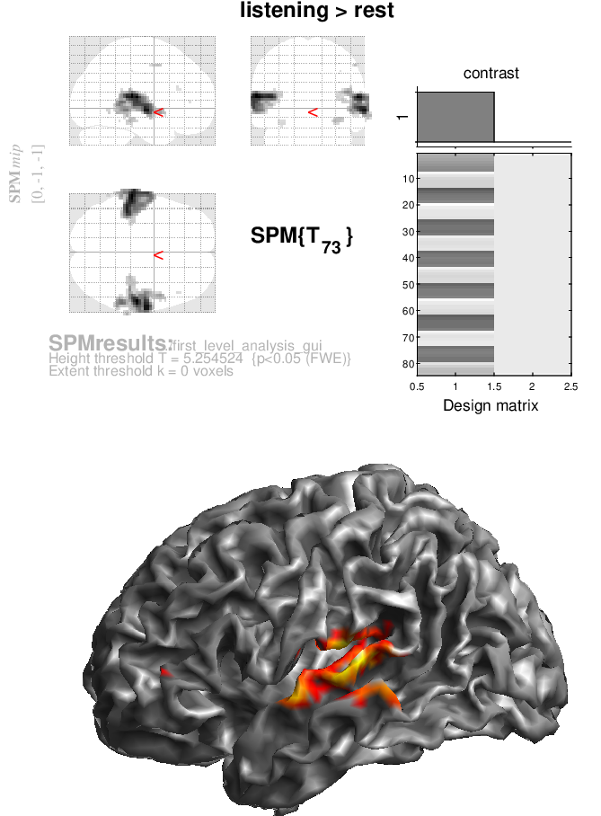
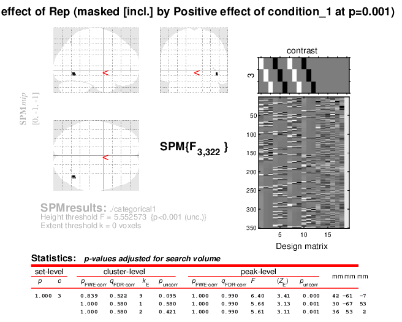
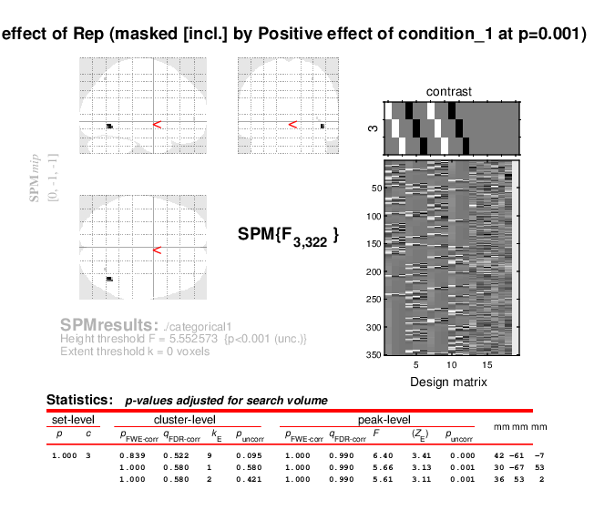
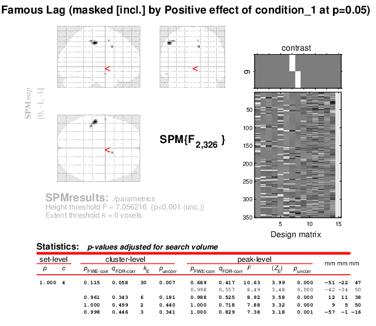
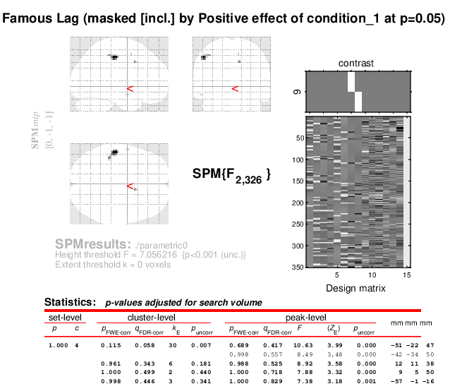

# spmbasics, a reproduction attempt


[](https://zenodo.org/doi/10.5281/zenodo.10953222)
### Understanding  and reproducing SPM Tutorials.

<Project description>
  
## Table of contents

   * [Overview](#Overview)


   * [How to reproduce each step](#How-to-reproduce-each-step)

      A. [Block Design fMRI Preprocessing Steps](#a-block-design-fmri-preprocessing-steps)
      
      B. [Block Design fMRI First Level Analysis Steps](#b-block-design-fmri-first-level-analysis-steps)

      C. [Event-related fMRI Steps](#c-event-related-fmri-steps)

      D. [Nipype-SPM Reproduction Steps](#d-nipype-reproduction-steps)

   * [Further on reproducibility](#Further-on-reproducibility)

## Overview


Version of the software used:```MATLAB R2020b```[reffered as MATLAB] & ```SPM12 (release 7771)```[reffered as SPM].

This repo contains my reproduction of the SPM12 tutorials with MATLAB R020b and they will be reffered as [original tutorial](https://www.fil.ion.ucl.ac.uk/spm/docs/tutorials/fmri/block/) from now on. 

You can download the data used for preprocessing in this tutorial from [here](https://www.fil.ion.ucl.ac.uk/spm/download/data/MoAEpilot/MoAEpilot.bids.zip). And the data used for event related fMRI analysis [here](https://www.fil.ion.ucl.ac.uk/spm/download/data/face_rep/face_rep.zip). 
You can find the code in the [src](src) folder.


## How to Reproduce Each Step

### A. Block design fMRI preprocessing steps 

First thing before the running the pipelines, add SPM to your path in MATLAB, via ```addpath /path/of/your/spm12/```. Because  all the scripts in this repo are calling SPM.

At the first lines of the all scripts, there is a section defining the data root which requires that ```/spmbasics``` folder to be specifically ```to be under your home directory```. If you wish to use any other path, you may need to redefine relative to your ```home``` directory. 

The corresponding ```root``` variable in the scripts should be adjusted accordingly to be able to load dataset.

Here is an example setting showing the MoAEpilot folder under  ```/data/MoAEpilot``` the corresponding line in your script should look like ```root = fullfile(home, 'spmbasics', '/data/MoAEpilot')```. 

For the face fMRI data ```root = fullfile(home, 'spmbasics', '/data/face_rep)```.
If you edit the folder names keep the edits in the code as well. 

Your folder structure should look like the example below:


To be able test the reproducibility afterwards, in your ```/data/``` folder keep three different copies of your original data, named according to the processes.  

For example ```MoAEpilot_script``` should contain the files to run the script interface. The ```root``` should be edited beforehand according to the pipelines, to avoid overwriting to the same folder.

As a last reminder,  most of the scripts meant to run in a clear window with no parameters. For the preprocessing pipelines there *may not* be any issue. But the analysis and modelling pipelines, strictly require to have a clear window to avoid clashing parameters under the same variable names. So as a rule it would be useful to ```clc``` and ```clear all``` or ```clear matlabbatch``` before, and/or after each time running the scripts.


Now steps of running these scripts:

All the scripts meant to run without loading the gui and all the dependencies are following the relative paths of your  ```spmbasics``` folder. 

To avoid redundancies in this long README I do not repeat the steps explained at the [original preprocessing tutorial](https://www.fil.ion.ucl.ac.uk/spm/docs/tutorials/fmri/block/preprocessing/realignment/).

If you want to load the scripts in this repo using the GUI interface it is possible and could be done by selecting data folder in similar methodology in the original tutorial.
Below, I am mainly explaining running codes in this repo as scripts.


<details>

<summary><strong> 1. GUI Interface </strong></summary>

<!--#### 1. GUI Interface:-->
 
 All the, ```.m``` files in the folder ```src/batch_step``` and they must be run subsequently. 
  1. Load and run [realignment_batch.m](src/batch_step/realignment_batch.m) first.
  Then run the script. It should produce a file starting with ```mean``` and ```r```. 
  2. Then run [slice timing_batch.m](src/batch_step/slice_timing_batch.m) 
      Run the script. It should produce a file starting with and ```ar```. 
  3. Follow by [coregistration_batch.m](src/batch_step/coregistration_batch.m).  Run the script and your anatomical images now be coregistered to the ```mean``` that we obtained at the realignment step. Deformation field is generated under ```/anat``` folder, with the name of ```y_sub-01_T1w.nii```
  4. Continue by running [segmentation_batch.m](src/batch_step/segmentation_batch.m)
      Segmentation script produce different segmentations  in the ```/anat/``` folder according to the predefined tissue probability maps. 
   5. Load and run [normalization_batch.m](src/batch_step/normalisation_batch.m) 
      This script produces files starting with ```war```
   6. Lastly [smoothing_batch.m](src/batch_step/smoothing_batch.m) This script produces the files starting with ```s``` and at the end in the ```/func``` folder there must be a version of the subject file starting with ```swar```
</details>

<details>
<summary><strong> 2. Batch Interface </strong></summary>   

<!-- #### 2. Batch Interface -->

 For the Batch interface inside ```/batch``` folder ```preprocessing_batch_job.m``` should be run. 
 *  If you want to follow the GUI, steps below:
     1. Load the [batch interface GUI](src/batch/preprocessing_batch.m) at the first step of the Batch interface ```Realign: Estimate &Reslice ``` select your data by specifiying  ```Data> Session```. And the rest is the same with the [tutorial](https://www.fil.ion.ucl.ac.uk/spm/docs/tutorials/fmri/block/preprocessing/batch/).

     2. The rest of the script should run automatically using the relative paths of your data.

* If it does not work, follow the steps in the [original preprocessing tutorial](https://www.fil.ion.ucl.ac.uk/spm/docs/tutorials/fmri/block/preprocessing/batch/) to define paths of your anatomical data.

</details>

<details>
<summary><strong> 3. Scripting </strong></summary>

<!-- #### 3. For scripting --> 

 * To be able to run the scripting, in ```/script``` folder, ```/preprocessing_script_job.m``` is the main file and it should be run.
   * In this tutorial I only edited and used  ```preprocessing_script_job.m``` solely.
   
   * NOTE: In the ideal setting, ```preprocessing_script.m``` controls the job of [preprocessing_script_job.m](src/preprocessing_job.m), but currently ```preprocessing_script.m``` is redundant so does not exist in this repo.
   
</details>

### B. Block Design fMRI First Level Analysis Steps

Relative path settings are the same as [Block Design fMRI Preprocessing](Block_Design_fMRI_Preprocessing) for the ```first_level_analysis.sh``` The rest of the two scripts are depending on the resulting ```SPM.mat``` under the ```/first_level_analysis_script``` folder.

<details> 

<summary><strong> 1. First Level Analysis GUI Interface </strong></summary>

<!-- #### 1. GUI Interface: -->

* Run ```first_level_specification_gui.m``` firstly it will form the ```SPM.mat``` file at the ```/first_level_analysis_gui``` folder. 
* And then run ```first_level_estimation_gui.m```
* To be able to obtain the T staticstics and perform inference and rendering, [original first level analysis tutorial](https://www.fil.ion.ucl.ac.uk/spm/docs/tutorials/fmri/block/modelling/block_design/) should be followed. 
* At the end, it is possible to get a rendered figure showing activations: 
</details>

<details>
<summary> <strong> 2. First Level Analysis Scripting </strong></summary>

<!-- #### 2. Scripting:-->

* All the scripts should be loaded subsequently,
         
   1. ```first_level_specification_script.m``` produces the ```SPM.mat file in the ```first_level_specification_script``` folder. The following scripts are taking this file as an input.
   2. The ```first_level_estimation_script.m``` does the GLM estimation.
   3. ```first_level_inference_script.m``` does the rendering. Calculates the estimation parameters and the T level statistics.
   
Resulting render can be seen here : 

</details>   


### C. Event-related fMRI Steps

I followed all the tutorial for sake of completion but focused on making event related preprocessing and parametric modelling mainly. 

<details>

<summary> <strong> 1-A. GUI Interface Preprocessing </strong> </summary>

<!-- #### 1. Preprocessing -->
GUI interface: 
This part is following exact steps of the [original tutorial](https://www.fil.ion.ucl.ac.uk/spm/docs/tutorials/fmri/event/preprocessing/). All the code files exported from the saved ```mat``` files.

 *   All the, ```.m``` files in the folder ```src/event_related_gui/preprocessing``` and they must be run subsequently. 
      1. Load & run [realign.m](src/event_related_gui/preprocessing/realign.m) first. 
      Then run the script. It should produce a file starting with ```mean``` and ```r```. 
      
      2. Then run [slice timing.m](src/event_related_gui/preprocessing/slice_timing.m) 
      Run the script. It should produce a file starting with and ```ar```. 

      3. Follow it by [coreg.job.m](src/event_related_gui/preprocessing/coreg.job.m).  Run the script and your anatomical images now be coregistered to the ```mean``` that we obtained at the realignment step. Deformation field is generated under ```/anat``` folder, with the name of ```y_sub-01_T1w.nii```
      4. Continue by running [segmentat.m](src/event_related_gui/preprocessing/segment.m)
      Segmentation script produce different segmentations  in the ```/anat/``` folder according to the predefined tissue probability maps. 
      5. Run [normalise.m](src/event_related_gui/preprocessing/normalise.m) 
      This script produces files starting with ```war```
      6. Lastly [smooth.m](src/event_related_gui/preprocessing/smooth.m)
      This script produces the files starting with ```s``` and at the end in the ```/func``` folder there must be a version of the subject file starting with ```swar```

</details>

<details>
<summary><strong> 1-B. Preprocessing via scripting </strong></summary>

Scripting: 
Run ```src/event_related_script/event_related_preprocessing_script.m```. And it should produce the exact same files with the gui interface in one step.

</details>

<details>

<summary><strong> 2. Categorical Modelling </strong></summary>

As a start, make sure that the file containing stimulus onset times in the dataset folder named ```sots.mat```  is loaded in the workspace. The scripting file is automatically loading it. 

<!--#### 2. Categorical Modeliing -->
 <details>

 <summary><strong>GUI Interface:</strong></summary>

In ```src/event_related_gui/categorical``` folder,
Firstly run ```categorical_spec.m```  firstly it will form the ```SPM.mat``` file at the ```/event_related_gui``` folder. And then run ```categorical_est.job.m```.

The further steps about the inference of the results is on the [event related tutorial page](https://www.fil.ion.ucl.ac.uk/spm/docs/tutorials/fmri/event/categorical/).

The figure highlighting the fstatistics can be seen here : 

 </details>

 <details>

 <summary><strong>Scripting:</strong></summary>

Run ```src/event_related_script/categorical_modelling.m```. 

It produces same result with the gui interface.

Resulting sample figure can be seen here : 
 </details>

</details>

<details>

<summary><strong> 3. Parametric Modelling  </strong></summary>
Similar to the categorical modelling,  ```sots.mat```  is necessary to be loaded in the workspace. 
<!--#### 3. Parametric Modelling-->
<details>

<summary><strong>GUI interface:</summary></strong>
   
Run ```parametric_spec.m```  firstly it will form the ```SPM.mat``` file at the ```/event_related_gui``` folder. And then run ```parametric_est.job.m```

The section describing inference steps to obtain the figure is on the [original event related tutorial](https://www.fil.ion.ucl.ac.uk/spm/docs/tutorials/fmri/event/parametric/).  
 
 Parametric lag effect can be seen like in this figure : 
 </details>

 <details>
 
 <summary><strong>Scripting:</strong></summary>

Run ```src/event_related_script/parametric_modelling.m```. It produces same result with the gui interface in single step.

Resulting figure is here : 

 
 </details>

</details>


<details>

<summary> <strong>  4. Bayesian Analysis is omitted for this tutorial. </strong> </summary>
 

<!--#### 4. Bayesian Analysis-->

* Run ```bayesian_spec.m```  firstly it will form the ```SPM.mat``` file at the ```/event_related_gui``` folder. And then run ```bayesian_est.job.m```.

The inference should be followed at the [original event related tutorial](https://www.fil.ion.ucl.ac.uk/spm/docs/tutorials/fmri/event/bayesian/).

</details>

### D. Nipype reproduction steps

Nipype is a python interface for multiple neuroimaging analysis packages to enable interoperability of the workflows. Using Nipype SPM interface all the aforementioned steps are re-implemented. 

To install nipype [this guide](https://miykael.github.io/nipype_tutorial/notebooks/resources_installation.html) and setting [these dependencies](http://miykael.github.io/nipype-beginner-s-guide/installation.html#download-and-install-interfaces) used. It is also recommmended to check the [nipype documentation](https://nipype.readthedocs.io/en/latest/users/install.html)


<details> 
<summary> <strong> 1. Block Design fMRI Preprocessing via Nipype-SPM</strong> </summary>

To reproduce the block design preprocessing using nipype run ```src/Nipype/nipype_spm_preproc.py```  using ``` python nipype_spm_preproc.py``` command or your IDE. 


</details>

<details>

<summary> <strong>  2. Block Design fMRI First Level Analysis via Nipype-SPM</strong> </summary>

Run
</details>

<details>
<summary> <strong> 3. Event-related fMRI via Nipype-SPM</strong></summary>
To reproduce run this
</details>

## Further on reproducibility

### Using Bash Script
SPM has a display and check reg features to visually inspect the outputs.
Visual inspection does not guarantee that all the results are the same.
To ensure about all of the steps producing same results after the same preprocessing steps, you can use [this](/src/shasum_checker.sh) *bash* script.
This script basically lists and compares the ```sha25sum``` values of the designated folders containing nifti files.  

Instructions to check hash values using the provided bash script:

* The script is in ```/src``` folder, named as ```shasum_checker.sh``` 

* Important note regarding to the base folder: Base folder should contain the results from the [batch_step](https://www.fil.ion.ucl.ac.uk/spm/docs/tutorials/fmri/block/preprocessing/introduction/) interface. It is recommended to run the ```shasum_checker.sh``` on it once it is finished and then lock the writing access using ``` chmod a=rx -R filename ``` for linux. 

To avoid loading everything at once it is possible to comment out within the script and perform tasks step by step.

* <u> REMINDER</u>: Make sure to save your results of preprocessing into different folders and direct their paths accordingly.

* For example, for results which obtained from  interface create a ```BATCH``` folder with the input data and make SPM run from there so it will create results of the  batch interface.

* You can see the results of your shasum comparisons as a text file in the [/results](results/comparison_result.txt) folder.

### Using python script

To keep every implementation in python, I re-implemented the bash code in python. 

Here are the steps how to use python script to obtain and compare shasums of the analysis outputs.

* steps to be written...[TODO]


Lastly keep in mind that every  instruction in this repo can change and serves the purpose of  my learning and testing. 

If you notice anything needs to be edited or fixed, feel free to open an issue. 

Thanks for your time and attention. :smile: 